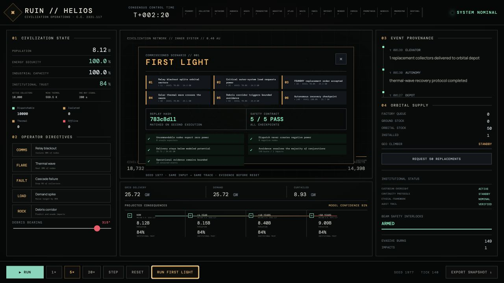
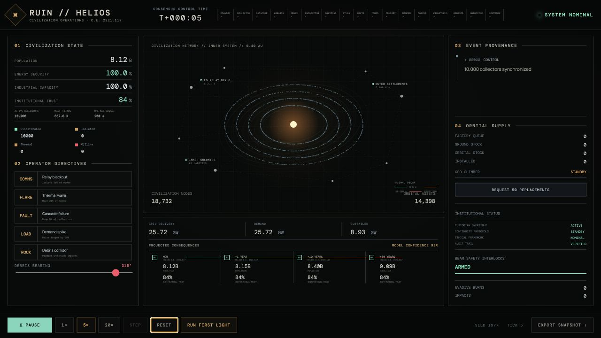
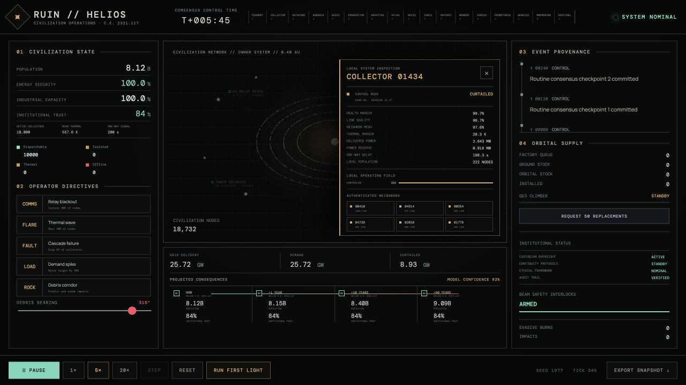

# RUIN // HELIOS

> Mission control for a star-sized distributed system.

[](https://github.com/nightandweather/ruin/actions/workflows/ci.yml)
[](LICENSE)
[](CONTRIBUTING.md)
[](https://nightandweather.github.io/ruin/)

RUIN is a speculative civilization-operations laboratory. **HELIOS**, its first module, is a deterministic browser simulation of an autonomous Dyson swarm: 10,000 independent solar collectors operating at 0.4 AU, balancing power demand against communication partitions, thermal limits, and cascading failures.

> I build mission-critical operational systems in domains where silent failure is unacceptable—first in radiotherapy, then as an open simulation laboratory for autonomous space infrastructure.

**[Run the public demo](https://nightandweather.github.io/ruin/)** · [Read the HELIOS deep dive](docs/HELIOS-DEEP-DIVE.md) · In the dashboard, choose **RUN FIRST LIGHT** to execute and replay the commissioned failure campaign.

[](https://nightandweather.github.io/ruin/ruin-first-light-72s.mp4)

**[Watch the 72-second walkthrough](https://nightandweather.github.io/ruin/ruin-first-light-72s.mp4)** · [Read the portfolio brief and 100-word application answer](docs/PORTFOLIO.md)

## Civilization-operations interface

[](https://nightandweather.github.io/ruin/)

The main situation room follows a deliberately restrained visual language: **NASA mission control × nuclear-submarine CIC × a forgotten civilization's oracle machine**. The star system dominates the screen; civilization vitals and event provenance sit at its edges; and a causal horizon shows how present power and communication failures can change population and institutional trust over 1, 10, and 50 years. Teal is reserved for verified state, amber for uncertainty, and red for irreversible outcomes. See the [HUD art direction and signal semantics](docs/HUD-DESIGN.md).

The orbital map is inspectable rather than decorative. Click a sampled collector or one of the labeled civilization sites to open its live local-system record: control mode, health, link and thermal margins, delivered power, nearby operating-state composition, six authenticated neighbors, active system hazards, and the current autonomy recommendation. Neighbor controls move through the mesh without leaving the situation room.

[](https://nightandweather.github.io/ruin/)

This is science-fiction software built from real engineering ideas. It is not a claim that a Dyson swarm can be built with present technology.

The [session origin note](docs/SESSION-2026-08-30.md) records how the project grew from a developer-learning idea into executable civilization infrastructure. The [engineering notes](docs/ENGINEERING-NOTES.md) separate grounded kernels, scenario assumptions, and next validation work for every executable module.

## Fiction prototype

RUIN is also being tested as a human-scale science-fiction narrative. **Season 01 — 99.97%의 구원** follows a junior simulation verifier who discovers that a perfect civilization-survival report was produced by changing who counts as a person. The fiction uses executable laboratory incidents as causal machinery while keeping unresolved questions—simulation consciousness, recurring identity, and RUIN's creator—open.

**[Read Episode 01 — 제외된 사람들](fiction/season-01/episode-01.md)** · [Narrative continuity and status](fiction/README.md)

## The RUIN laboratory

RUIN is a home for executable science-fiction infrastructure. Each concept begins as a sourced engineering brief, defines what must never happen, and grows into a deterministic simulation that lets an operator experience the tradeoffs.

- [Concept registry](concepts/README.md) — current and proposed infrastructure modules.
- [Orbital elevator](concepts/orbital-elevator.md) — factory queues, climbers, tether safety, and orbital depots.
- [Lunar mass driver](concepts/mass-driver.md) — electromagnetic cargo launch with fail-closed corridor authorization.
- [Transit Gate](concepts/transit-gate.md) — quantum-state transfer, speculative wormholes, and exactly-once identity reconstruction.
- [Stellar survey](concepts/stellar-survey.md) — source-backed ranking of nearby systems for an industrial swarm bootstrap.
- [Fleet operations](concepts/fleet-operations.md) — convoy protection, rescue, logistics, and damage control under delayed command.
- [Technology tree](concepts/technology-tree.md) — a tested path from autonomous foothold to system-scale and speculative infrastructure.
- [Concept template](concepts/template.md) — a repeatable path from a wild idea to testable software.

HELIOS is the first executable module rather than the limit of the repository.

## Run it

```bash
npm install
npm run dev
```

Open the displayed local URL. `/` runs HELIOS; the module bar links every laboratory, including `/horizons.html` for the connected post-stellar civilization network, `/prometheus.html` for civilian fission power and NEP, `/genesis.html` for the stellar bootstrap campaign, `/mnemosyne.html` for neural identity evidence, and `/sentinel.html` for system-wide fault response.

- **HELIOS** — inject a relay blackout, thermal wave, manufacturing cascade, demand spike, or directional debris corridor and watch the controller redistribute safe capacity.
- **FOUNDRY** — order repair kits and watch robotic excavation, grading, molten-regolith refining, machining, and assembly propagate material and bottlenecks through the factory.
- **COLLECTOR** — resize a seed collector's wings, radiators, shielding, propellant, and orbit while power, heat, mass, geometry, and factory burden update together.
- **DATACORE** — schedule verified GPU workloads against collector power, radiator capacity, radiation scrubbing, and optical-link availability.
- **AGRARIA** — tune crop area, light, carbon, water, nutrients, and crop strategy while food, oxygen support, and power demand update together.
- **AEGIS** — design a mission-specific pressure suit and expose its mass, mobility, life-support, thermal, dust, and emergency-return tradeoffs.
- **HYGEIA** — manage crew radiation exposure across storm shelters, hull shielding, EVA recall timing, and a fail-closed career-dose allowance that refuses over-limit assignments outright.
- **PROGENITOR** — grow a robotic industrial seed while production closure, imported controllers, metrology, lineage drift, and a human-set replication ceiling remain explicit.
- **GRAVITAS** — trade rotating-habitat radius, RPM, gravity level, Coriolis effects, deck gradient, structure, spin energy, and angular-momentum cancellation.
- **ATLAS** — rotate and filter a heliocentric 3D map of 30 curated real stars, inspect catalog coordinates and planet counts, and expose interstellar communication and hypothetical cruise latency.
- **NAVIS** — couple spacecraft mass, propulsion, power, waste heat, radiator area, communications, autonomy, and ATLAS route distance while exposing model maturity and no-go boundaries.
- **IGNIS** — design chemical, Hall-electric, nuclear-thermal, and explicitly unsupported fusion engines while thrust, specific impulse, power, mass flow, propellant, heat rejection, transient heat storage, cluster failures, and burn authorization remain coupled.
- **ODYSSEY** — fly between curated ATLAS stars while HELIOS and deep relays beam power and navigation references through diffraction, pointing error, receiver capture, light-time, thermal, autonomy, and relay-outage constraints.
- **MENDER** — configure orbital and surface repair robots while reaction torque, anchoring, reach, payload, tools, energy, heat rejection, and delayed-command autonomy remain coupled.
- **CORVUS** — design autonomous civilian space-drone swarms whose propulsion, solar power, battery survival, heat rejection, crosslinks, relative separation, quorum, and delayed-command autonomy remain coupled.
- **KESSLER** — run fifty years of debris population dynamics in a dragless band where the cascade feeds on itself, removal is the only sink, and a fail-closed moratorium halts installation past the density cap.
- **PROMETHEUS** — connect fission heat, power conversion, survival and factory loads, radiation separation, radiators, and low-thrust nuclear-electric propulsion without reactor-construction or weapon detail.
- **GENESIS** — run a century-scale seed campaign from first resource survey through certified factory replication, stellar-power independence, habitation, and local self-sufficiency.
- **MNEMOSYNE** — test structural, synaptic, dynamic, glial, molecular, memory, behavioral, embodiment, consent, and fork evidence without claiming that a mind or consciousness has been transferred.
- **SENTINEL** — inspect 51 failure-response plans across every executable module, from early indicators and deterministic safing to fallback operation, human decisions, recovery evidence, and non-negotiable safety invariants.
- **HORIZONS** — operate fourteen connected post-stellar systems—WORMWAY, CHRONOS, STELLAR FORGE, ARK, EXODUS, ORACLE, DARKLIGHT, MNEMOSYNE, TERRAFORM, WORLD ENGINE, NECROPOLIS, FIRST CONTACT, MATRIOSHKA BRAIN, and SEED—on one causal map. Inject a failure, inspect its dependency blast radius, execute evidence-gated recovery, choose a civilization priority, and resolve the consequences across 10, 50, and 100 years.

```bash
npm test
npm run build
```

## What is simulated

- 10,000 individually modeled collectors across eight orbital bands.
- A commissioned FIRST LIGHT incident sequence with checkpoint evidence, five executable safety invariants, and a second-run deterministic replay hash.
- Seeded pseudo-random initial conditions and fault selection for reproducible runs.
- Per-node health, link quality, thermal state, capacity, delivery, and operating mode.
- Safe dispatch under demand changes, thermal derating, offline nodes, and network partitions.
- Recovery windows and a bounded event stream.
- Directional debris conjunctions, pre-impact power derating, avoidance burns, and residual impacts.
- Surface factory orders, replacement production, orbital-elevator cargo cycles, orbital inventory, and automatic installation.
- A second executable FOUNDRY module with autonomous excavation, beneficiation, refining, trace-metal inventory, machine tooling, assembly, wear, and cascading production faults.
- Reweightable nearby-star scoring with explicit catalog sources and uncertainty notes.
- A non-weaponized fleet-survival core for debris, thermal, contact, and communications incidents.
- A parametric C-01 collector digital twin with a live schematic, thermal articulation, fail-closed beam control, and a FOUNDRY material bill.
- A radiation-aware orbital GPU fabric with replicated results, thermal and power admission control, optical data locality, and space-native job queues.
- A bioregenerative crop-deck model linking food, oxygen-equivalent exchange, recovered water, nutrient makeup, quarantine, and collector power.
- A parametric EVA suit digital twin spanning orbit, lunar industry, Mars field work, and rescue, with coupled PLSS, mobility, mass, dust, and fault-response constraints.
- A guided robotic self-production model with a physically zoned factory layout, partial production closure, certified lineage, import bottlenecks, and fail-closed offspring quarantine.
- A physics-grounded artificial-gravity architect for rings, tether pairs, and short-arm centrifuges, with an explicit no-go boundary for unsupported gravity-field generators.
- A real-coordinate nearby-star atlas that converts ICRS right ascension, declination, and distance into heliocentric XYZ positions while keeping curated coverage distinct from the full Gaia catalog.
- A mission-configurable spacecraft architect using the ideal rocket equation, thrust-derived acceleration and burn time, radiative heat rejection, distance-squared link scoring, light-time, and explicit propulsion maturity.
- A propulsion engine laboratory coupling equivalent exhaust velocity, mass flow, power-limited electric thrust, cluster engine-out behavior, transient heat storage, radiator capacity, propellant endurance, and evidence-based ignition authority.
- A Dyson-powered interstellar corridor linking real nearby-star distances to optical diffraction, pointing jitter, relay light-time, receiver capture, electric thrust, heat rejection, navigation uncertainty, and stored-energy survival.
- A task-grounded robotic repair architect with two-point contact, reaction-moment stability, seven-DOF servicing arms, tool and payload contracts, battery endurance, recharge, heat rejection, and signal-delay autonomy.
- An autonomous civilian drone-swarm architect coupling per-node mass, delta-v, solar power, battery hold, and heat rejection to formation spacing, crosslink range, distributed quorum, collision reserve, and light-time autonomy.
- A civilian fission and NEP architect coupling thermal power, conversion, electrical loads, radiators, radiation separation, propellant, thrust, and degraded safe states.
- A cross-module stellar bootstrap campaign linking PROMETHEUS, CORVUS, FOUNDRY, PROGENITOR, HELIOS, AGRARIA, and GRAVITAS into evidence-gated milestones.
- A neural identity-evidence laboratory that refuses to equate a connectome, behavioral imitation, or copied memory with demonstrated continuity and treats every fork as independent personhood.
- A cross-system FDIR registry covering 17 executable modules with 51 detected, isolated, safed, fallback-capable, evidence-gated recovery plans and explicit dependency blast radius.
- A deterministic post-stellar causal network linking fourteen speculative systems through explicit resources, dependencies, catastrophic failures, safety invariants, recovery policies, and century-scale civilization projections.
- Downloadable JSON snapshots for later replay or analysis.

The browser draws a representative orbital sample but the controller updates all 10,000 nodes every tick.

## Physical assumptions

HELIOS separates sourced physical constants from invented system parameters:

- Solar irradiance starts at `1361 W/m²` at 1 AU and follows an inverse-square approximation. NASA reports approximately this value for total solar irradiance near Earth.
- Waste heat uses a simplified radiative-equilibrium calculation based on the Stefan–Boltzmann law.
- Collector area, 42% conversion efficiency, radiator area, temperature limits, fault rates, repair times, beam delivery, and control policy are speculative scenario parameters.
- Orbital positions are visualized, not propagated with an N-body integrator. Collisions, station keeping, diffraction, transmission losses, material degradation, and signal travel time are future model layers.
- Debris corridors use angular proximity in the visualization plane rather than a high-fidelity ephemeris and covariance model. The detect–assess–mitigate workflow is inspired by real conjunction assessment, while its outcomes are speculative.
- The space elevator is a logistics state machine, not a structural dynamics model. Factory throughput, batch size, transit time, and installation rate are deliberately accelerated scenario parameters.

Sources:

- [NASA GSFC: Radiative Transfer](https://science.gsfc.nasa.gov/earth/climate/researchareas/159/)
- [NASA Passive Thermal Control Engineering Guidebook](https://ntrs.nasa.gov/citations/20230013900)
- [NASA: Conjunction Assessment and Collision Avoidance](https://www.nasa.gov/cara/)
- [NASA NTRS: Technology Development and Demonstration Concepts for the Space Elevator](https://ntrs.nasa.gov/citations/20040161582)
- [NASA: Lunar Surface Technology and ISRU](https://www.nasa.gov/lunar-surface-technology/)
- [NASA NTRS: System Modeling of a Lunar Molten Regolith Electrolysis Plant](https://ntrs.nasa.gov/citations/20240012420)
- [NASA NTRS: Manufacturing and Metal Extraction Lunar Technology](https://ntrs.nasa.gov/citations/20230009049)
- [Freeman Dyson, “Search for Artificial Stellar Sources of Infrared Radiation” (1960)](https://doi.org/10.1126/science.131.3414.1667)

## Architecture

```text
seed + configuration
        ↓
10,000 collector digital twins
        ↓
fault and environment scenarios
        ↓
safety filter → capacity dispatcher
        ↓
snapshot + event log + control dashboard

damage report → factory order → GEO climber → orbital depot → replacement
```

The simulation engine in `src/simulation.ts` has no browser dependency. That keeps deterministic scenarios testable and leaves room for a future CLI, server, or distributed implementation.

## Next missions

- Event replay and scenario files.
- Signal propagation delay and local consensus between orbital sectors.
- Ephemeris and covariance-based conjunction probability instead of the current angular corridor model.
- Power-beam destinations, exclusion corridors, and transmission loss.
- Elevator tether health, climber energy budgets, launch windows, and debris avoidance.
- Infrared waste-heat signature and observability from distant systems.
- A campaign mode in which the swarm grows from hundreds to billions of collectors.

## Beyond Kardashev II

HELIOS begins with the operating problems of a civilization using a meaningful fraction of one star. The next scales are less about finding more energy and more about governing systems that can no longer share a present moment.

| Scale         | Operational problem                                                         | Candidate simulation                                      |
| ------------- | --------------------------------------------------------------------------- | --------------------------------------------------------- |
| Planetary     | Climate, orbital debris, and globally coupled infrastructure                | Multi-objective planetary control with hard safety limits |
| Stellar       | Heat rejection, beam safety, solar weather, and swarm autonomy              | The current HELIOS mission                                |
| Interstellar  | Years of communication delay and colonies with diverging goals              | Policy replication without a global leader                |
| Galactic      | Stellar lifecycles, relativistic travel, and million-year plans             | Eventually consistent governance across causal horizons   |
| Post-galactic | Entropy budgets, black-hole energy, and survival across cosmological change | Deep-time resource allocation with irreversible decisions |

These are storytelling frames, not settled extensions to the Kardashev scale. Each future module should turn one frame into explicit state, constraints, failure modes, and testable policies.

## Help design what comes after Kardashev

**카르다쇼프 척도 다음 단계로 가기 위한 아이디어를 모집합니다.**

RUIN is looking for strange, serious questions about civilizations that do not exist yet. Propose an orbital machine, interstellar institution, deep-time failure, impossible transport system, post-biological habitat, or an entirely new category we have not imagined.

A strong proposal does not need to know how to build the technology. It only needs to give us something that can become executable:

- What is the system trying to accomplish?
- What resources, energy, information, and prior technologies does it require?
- What must never happen?
- How does it fail when communication is late or nobody is in charge?
- Which assumptions come from observed science, and which are deliberately speculative?
- What would an operator be able to change and observe in a simulation?

[Open an idea proposal](https://github.com/nightandweather/ruin/issues/new) or use the [concept template](concepts/template.md). Wild ideas are welcome; falsifiable assumptions, safety invariants, and interesting failure modes make them buildable.

## Contributing

RUIN is public, MIT-licensed open source. Code, research, interface, accessibility, documentation, and strange-but-operational concept contributions are welcome. Read [CONTRIBUTING.md](CONTRIBUTING.md) for setup, modeling rules, module structure, and safety boundaries; use [GitHub Discussions](https://github.com/nightandweather/ruin/discussions) for early ideas and the [issue forms](https://github.com/nightandweather/ruin/issues/new/choose) for scoped work.

Community participation follows the [code of conduct](CODE_OF_CONDUCT.md). Potential vulnerabilities should be reported privately according to [SECURITY.md](SECURITY.md).

## License

MIT
