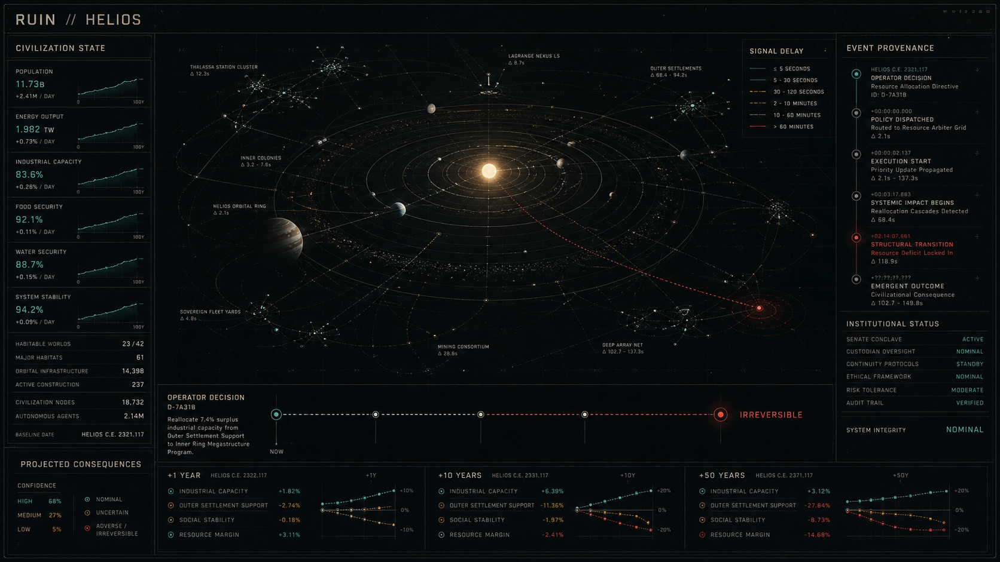
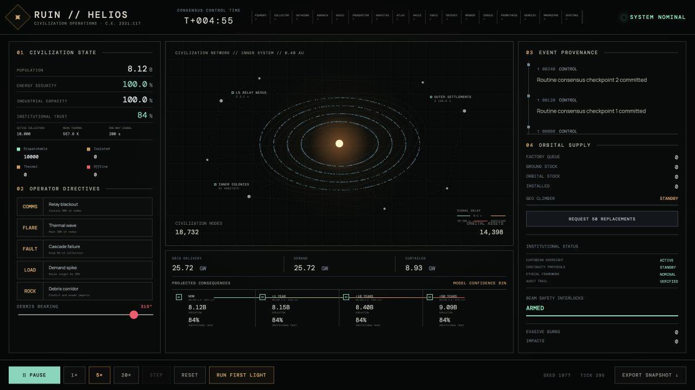

# RUIN HUD art direction

RUIN is an operations interface for civilization-scale systems, not a collection of dark SaaS dashboards and not a game HUD. Its visual target is:

> NASA mission control × nuclear-submarine CIC × a forgotten civilization's oracle machine

The concept image fixes the composition and visual language. The shipped interface remains code-native HTML, canvas, SVG, and CSS driven by simulation state; the bitmap is not used as a decorative background.

## Composition

- The central star system and civilization network own most of the visual field.
- The left ledger reports civilization-scale conditions before local equipment detail.
- The right ledger preserves event provenance, logistics, institutional status, and safety authority.
- The lower causal horizon connects a present operator state to projected outcomes at now, +1 year, +10 years, and +50 years.
- Large areas of disciplined darkness establish scale. Extra panels do not.

## Signal semantics

| Signal                     | Meaning                                   | Usage rule                                                       |
| -------------------------- | ----------------------------------------- | ---------------------------------------------------------------- |
| Bone white / oxidized gray | archival structure and unverified context | default typography, borders, orbital records                     |
| Teal                       | verified nominal state                    | safe dispatch, validated institutions, connected nodes           |
| Amber                      | uncertainty or bounded degradation        | isolated links, thermal load, incomplete confidence              |
| Red                        | irreversible or physically lost state     | confirmed loss, critical status, terminal causal projection only |

Purple neon, glassmorphism, rounded consumer cards, bloom-heavy holograms, and decorative targeting reticles are explicitly excluded.

### Redundant encoding

A hue alone is not a signal. Roughly one in twelve men and one in two hundred women cannot separate this palette reliably, and nobody sees it through a greyscale print of an incident report, a monochrome camera, or a failing display. An operations interface whose meaning disappears under any of those conditions is not an operations interface.

So every state expressed in colour is also expressed in shape. The vocabulary is fixed once in `src/signal.css`; each stylesheet binds it to its own class names, next to the component it belongs to.

| State                              | Mark                             | Glyph |
| ---------------------------------- | -------------------------------- | ----- |
| Verified nominal                   | the component's own neutral mark | `●`   |
| Bounded uncertainty or degradation | that mark rotated to a diamond   | `◆`   |
| Irreversible or physically lost    | a triangle                       | `▲`   |

The neutral mark is whatever shape the component already uses — the HELIOS status dots are squares, the laboratory tile fields are circles — because its job is to be the form a caution or hazard departs from, not to be a particular shape. Neutral, diamond and triangle are the ISO ordering of routine, caution and hazard, and they survive greyscale, low resolution, and a photocopier. Chart series take the same treatment: every series carries a dash pattern as well as a hue, and `SeriesKey` in `src/LabKit.tsx` draws the pattern in the legend so series are matched by shape rather than from memory.

Two exceptions are deliberate and recorded rather than assumed:

- **Nominal state carries no mark of its own.** The circle is the baseline a caution or hazard mark departs from; putting a glyph on every quiet reading would make the marked states harder to find, not easier.
- **Amber does two jobs.** It is the caution hue, and it is also the HELIOS chassis accent for identity and interaction — section numerals, the active module, a hovered control, a progress fill. Those are furniture, not claims about system state.

`tests/signalEncoding.test.ts` enforces this. It derives the list of state selectors from the stylesheets themselves rather than from a hand-kept list, so a colour-only state fails CI the moment it is written; every exemption must name the channel that replaces the shape, and a stale exemption fails too.

**Known limit.** The orbital map draws ten thousand collectors at roughly two pixels each, where no shape is resolvable and colour is the only channel available. The mode legend beside it carries the same information as labelled counts, and selecting any collector opens its state as text.

## Civilization consequence projection

`src/civilizationProjection.ts` converts the current HELIOS power deficit, isolation ratio, offline fraction, and thermal fraction into a transparent scenario-stress proxy. That proxy drives population and institutional-trust projections across four horizons.

These figures are scenario outputs, not demographic forecasts. Their purpose is to make delayed operational consequence legible. Normal state stays quiet; compound communication and demand failures can cross an irreversible display threshold; clearing temporary incidents returns the projection to its nominal envelope. Automated tests cover all three behaviors.

## Interaction discipline

- Routine motion is slow orbital drift and low-amplitude telemetry change.
- Warnings do not pulse or glow unless operator attention is required.
- Red is never used for branding or decoration.
- No state is ever expressed in colour alone.
- FIRST LIGHT remains the primary commissioned scenario and evidence surface.
- Every projected consequence must trace back to visible current state rather than an arbitrary score.
- The orbital map supports direct collector selection, while the three named civilization sites provide keyboard-accessible inspection entry points.
- A selected collector remains bound to live control ticks. Its local record exposes health, link and thermal margins, power, nearby mode composition, active hazards, and the controller's recommended action.
- Selecting an authenticated neighbor moves the inspection context through the mesh; closing the record returns to the unchanged civilization-scale view.

### Local-system inspection

## Reference states

### Nominal civilization envelope

### Compound communication and demand failure

