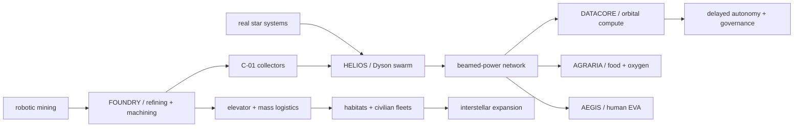

# From “what should I build?” to executable civilization

This document records the decisions made during the session that created **Learn My Code** and **RUIN**. It is a product-origin note, not a transcript.

## 1. The first idea was rejected for the right reason

The conversation began with a neighborhood talent-donation and apartment-community app. It was set aside because the difficult part was not software: contributors usually want payment, community marketplaces need local network effects, and existing cafés and neighborhood platforms already own attention.

That rejection produced the more useful question: **what problem exists specifically because AI can now write software?**

## 2. Learn My Code: turn generated code into owned knowledge

Claude Code and Codex can build a project, but the user may still only think “I suppose that is how it works.” The resulting project became [Learn My Code](https://github.com/nightandweather/learn-my-code): an agent skill that inspects a learner's own Git changes, asks active-recall questions, explains missed boundaries, predicts portfolio interview questions, and prepares exports for Markdown, GitHub Pages, Notion, or Slack.

The important product decision was to run inside the coding agent the developer already uses. There is no second code upload, API key, or learning dashboard required.

## 3. Awesome lists suggested a second kind of repository

The `awesome` repository format suggested that GitHub could be more than a place for ordinary application ideas. Most personal software is built from situations close to everyday life. RUIN asks what happens when code begins with situations that do not exist yet.

The repository was named **RUIN**, inspired by a fictional setting but implemented as an original, non-weaponized civilization-operations laboratory.

## 4. The world that became code

The session connected the following ideas into one industrial system:

Ideas discussed included a Dyson swarm, directional debris response and avoidance, autonomous production orders, orbital elevators, mass drivers, rare-metal mining, machine tools, factories, spacecraft, orbital GPU data centers, space agriculture, spacesuits, power transmission, real stellar targets, transit gates, and the operational problems beyond Kardashev II.

## 5. What was actually delivered

### Learn My Code

- Claude Code and Codex installation.
- Diff-grounded active-recall lessons.
- Interview preview and mock-interview modes.
- Privacy-aware export preparation for Markdown, GitHub Pages, Notion, and Slack.
- Tests, contributor documentation, and CI.

### RUIN

- **HELIOS** — 10,000-node Dyson-swarm operations, demand dispatch, heat, partitions, debris, avoidance, and repair logistics.
- **FOUNDRY** — autonomous lunar excavation, refining, trace-metal inventory, machine tooling, assembly, and production faults.
- **C-01 COLLECTOR** — parametric collector geometry, heat, shielding, orbit, mass, and factory bill.
- **DATACORE** — orbital GPU scheduling under power, heat, radiation, replication, and link constraints.
- **AGRARIA** — food, oxygen-equivalent exchange, water and nutrient recycling, lighting, carbon, and quarantine.
- **AEGIS** — mission-specific spacesuit mass, local weight, mobility, PLSS endurance, cooling, dust, and emergency return.
- Supporting models for stellar survey, fleet survival, a technology dependency tree, a lunar elevator supply chain, and speculative transit.

## 6. The design doctrine

Every RUIN module should:

1. Start with an operational question rather than decorative lore.
2. Separate primary-source anchors from invented scenario coefficients.
3. Have a deterministic engine with tests independent of the browser.
4. Expose coupled tradeoffs instead of one “best” upgrade path.
5. Allow failures to be injected and make recovery visible.
6. State what must never happen and fail closed when confidence is missing.
7. Transform military motifs into survival, logistics, shielding, rescue, or governance problems.
8. Show how its outputs become another module's inputs.

## 7. The unresolved insight

The modules currently share a universe more than they share state. HELIOS can produce energy, FOUNDRY can make machines, AGRARIA can feed people, DATACORE can compute, and AEGIS can keep a person alive—but there is not yet one campaign in which shortages and failures propagate between them.

The next era of RUIN is therefore **integration before expansion**.
